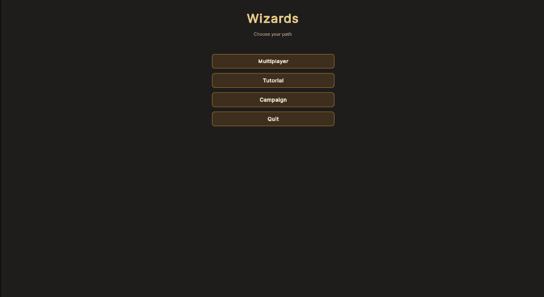
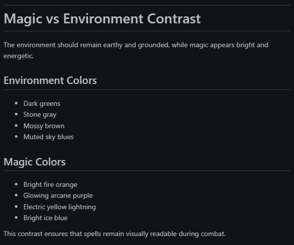

# Learning with AI  
## Spell Arena -Learning Art Direction 

**Landen Tomlin**  
ASE 485 – Capstone Project

---

# How I Used AI
- Art direction
- Learning methods of implementation
- Inspiration over direct implementation
- Learning through communication

---
# The Models I Used
- ChatGPT Free Tier (Discussions about art mood boards)
- Claude Sonnet (Code Review and Questioning)
- Cursor (Starting point for use of USS and UXML)

---
# What I've Learned
- Communicating with ChatGPT as a means of inspiration helped me through roadblocks
- Art Direction in video games can be suplemented by Ai, but should not be fully created through Ai as the human touch is what makes art great.
- Forms of UI creation in Unity games using the UI toolkit is easier than the method I was using before.

---
# Forms of UI Tools in Unity
## Unity GUI
  - How it works:
    - You visually build UI directly in the scene hierarchy. 
    - Everything is part of the GameObject system.
    - Layout is controlled via anchors, pivots, and layout groups
    - Drag and Drop features that live in the game scene
---
# Forms of UI Tools in Unity
## UI Toolkit 
- Inspired by Web Development and uses UXML (HTML) and USS (CSS)
    - How it works:
      - UI is defined in documents instead of GameObjects
      - Uses a retained-mode UI system (more efficient)
       - Styles are reusable and themeable
---
# Example of UXML
```<ui:UXML xmlns:ui="UnityEngine.UIElements" editor-extension-mode="False">
    <Style src="WizardTheme.uss" />
    <ui:VisualElement name="main-menu-root" class="wizard-menu-root" picking-mode="Position">
        <ui:Label text="Wizards" class="wizard-title" />
        <ui:Label text="Choose your path" class="wizard-subtitle" />
        <ui:VisualElement class="wizard-main-column">
            <ui:Button name="multiplayer-button" text="Multiplayer" class="wizard-button" />
            <ui:Button name="tutorial-button" text="Tutorial" class="wizard-button" />
            <ui:Button name="campaign-button" text="Campaign" class="wizard-button" />
            <ui:Button name="quit-button" text="Quit" class="wizard-button" />
        </ui:VisualElement>
    </ui:VisualElement>
</ui:UXML>
```
---
# Example of USS
```
.wizard-menu-root {
    flex-grow: 1;
    width: 100%;
    height: 100%;
    background-color: rgba(18, 10, 6, 0.94);
    padding: 40px;
    align-items: center;
    justify-content: flex-start;
}

.wizard-main-column {
    flex-direction: column;
    align-items: stretch;
    width: 55%;
    max-width: 440px;
    margin-top: 24px;
}
```
---

# In Game Example

</img>

---

# Art Direction Tips from AI
- By building mood boards and design documents, I was able to help narrow down the theme that we want for our game
- This is shown mainly through the campaign and the choices Philip made when making the scenes.
- ChatGPT gave tips for what an early game scene should look like and I will make sure the arenas match those themes.

---
# Design Document Example
</img>

---

# Conclusion
- Ai is truly a tool that can be leveraged rather than something that should do the work for you. Especially when it comes to art.
- Understanding how users interact with UI elements is crucial to a well designed game.
- Without AI I would not have been able to learn UXML and USS as quickly as I did, even if they build off of HTML and CSS.